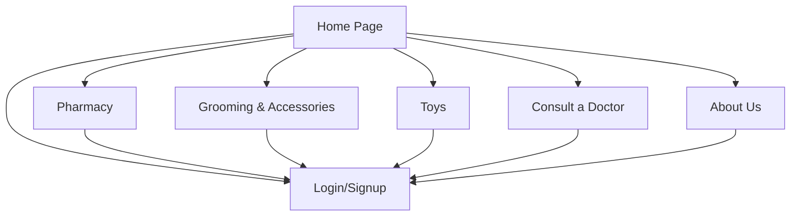
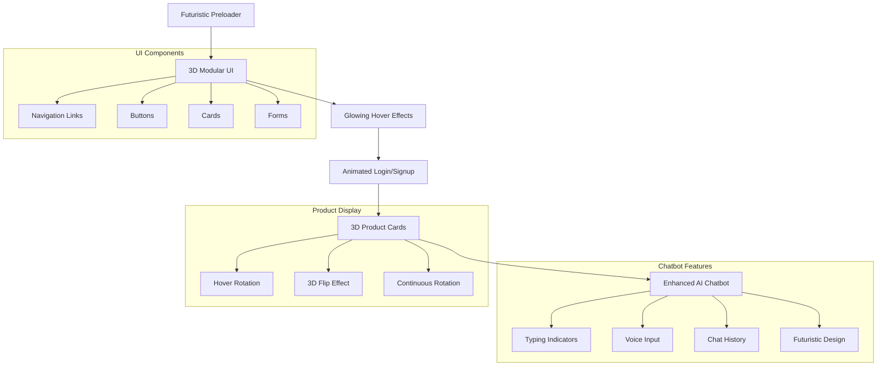

# Furry Tails Website Architecture

## Current Structure

## Planned Enhancements

## Implementation Plan

1. **Preloader Enhancement**
   - More futuristic animation
   - Consistent across all pages

2. **3D Modular UI Design**
   - Glowing hover effects on all interactive elements
   - Enhanced depth and dimensionality

3. **Login/Signup Pages**
   - Animated form transitions
   - Enhanced visual feedback

4. **Product Cards**
   - 3D rotation on hover
   - Improved visual design

5. **AI Chatbot**
   - Typing indicators
   - Voice input capability
   - Chat history persistence
   - Futuristic visual design

This architecture will provide a cohesive futuristic experience across all pages of the Furry Tails website.